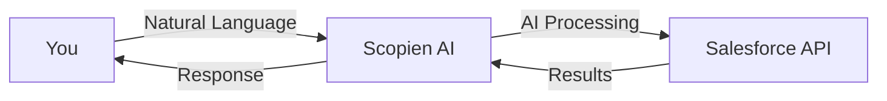

# Introduction to Scopien AI

Scopien AI is revolutionizing how businesses interact with Salesforce. Instead of navigating through countless menus and forms, simply tell Scopien what you need, and watch it happen instantly.

## The Problem We Solve

Traditional Salesforce workflows are:
- **Time-consuming**: Hours spent clicking through menus
- **Complex**: Steep learning curve for new users
- **Error-prone**: Manual data entry leads to mistakes
- **Inefficient**: Repetitive tasks waste valuable time

## Our Solution

Scopien AI provides:
- **Natural Language Interface**: Talk to Salesforce like you're talking to a colleague
- **Intelligent Automation**: AI understands context and executes complex operations
- **Real-time Insights**: Instant analysis of your Salesforce data
- **Seamless Integration**: Works with all Salesforce clouds

## How It Works

1. **You Ask**: Type or speak your request in plain English
2. **AI Understands**: Our AI interprets your intent and context
3. **Action Executes**: Scopien performs the necessary Salesforce operations
4. **You Get Results**: See immediate feedback and data

## Key Capabilities

### Data Management
- Create, update, and delete records
- Bulk operations on multiple records
- Data validation and cleanup
- Import/export functionality

### Reporting & Analytics
- Generate custom reports instantly
- Visualize data with charts and graphs
- Predictive analytics
- Trend analysis

### Automation
- Workflow automation
- Scheduled tasks
- Event-triggered actions
- Custom business logic

### Integration
- Connect multiple Salesforce orgs
- Third-party app integration
- API access for developers
- Webhook support

## Use Cases

### Sales Teams
> "Show me all opportunities closing this month with value over $50k"

Instantly retrieve and analyze deals without navigating reports.

### Service Teams
> "Create a case for customer ABC Corp about their billing issue and assign it to the billing team"

Create and route cases in seconds.

### Marketing Teams
> "Generate a report of lead sources and conversion rates for Q4"

Get insights without waiting for report generation.

### Executives
> "What's our revenue forecast for next quarter?"

Access critical metrics instantly.

## Why Choose Scopien AI?

| Feature | Traditional Salesforce | Scopien AI |
|---------|----------------------|------------|
| Learning Curve | Steep | Minimal |
| Task Completion | Multiple steps | Single command |
| Data Analysis | Manual reports | Instant AI insights |
| Automation | Complex setup | Natural language |
| Mobile Access | Limited | Full featured |

## Getting Started

Ready to transform your Salesforce experience? Follow these steps:

1. [Install Scopien AI](installation.md)
2. [Complete the Quick Start Guide](quick-start.md)
3. [Connect your Salesforce org](../user-guide/salesforce-integration.md)
4. [Start using the AI Assistant](../user-guide/ai-assistant.md)

## Next Steps

- [Installation Guide →](installation.md)
- [Quick Start Tutorial →](quick-start.md)
- [Watch Video Tutorials](https://scopien.com/tutorials)

---

**Questions?** Visit our [FAQ](../advanced/troubleshooting.md) or [contact support](https://support.scopien.com).
