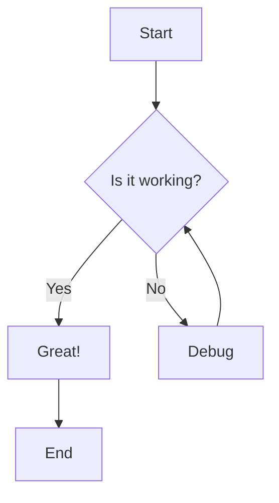
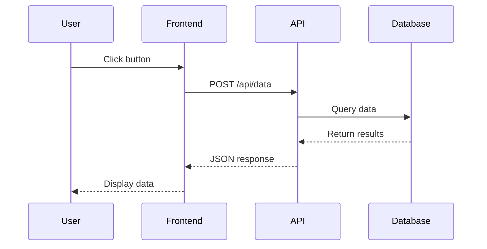
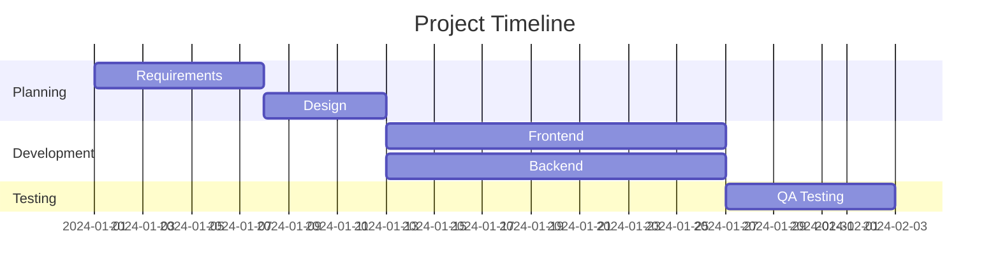
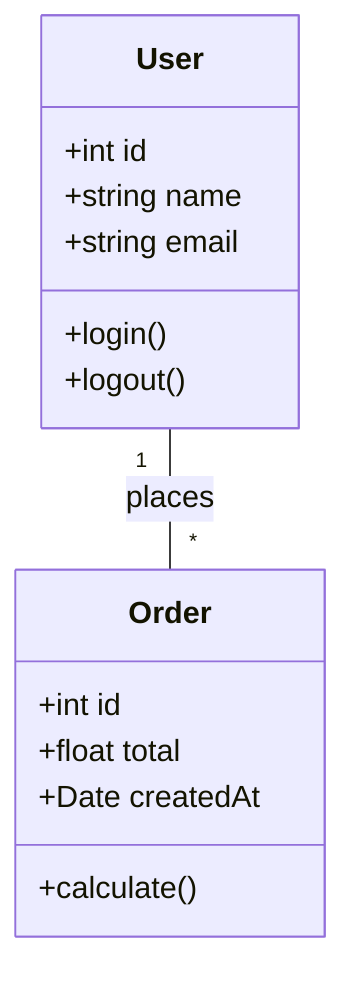

# Complete Markdown Cheat Sheet

This document demonstrates **every possible markdown pattern** you'll encounter. Use this to test your frontend UI rendering.

---

## Table of Contents

- [Headers](#headers)
- [Text Formatting](#text-formatting)
- [Lists](#lists)
- [Links](#links)
- [Images](#images)
- [Code](#code)
- [Tables](#tables)
- [Blockquotes](#blockquotes)
- [Horizontal Rules](#horizontal-rules)
- [HTML Elements](#html-elements)
- [Special Features](#special-features)
- [Complex Combinations](#complex-combinations)

---

## Headers

# H1 Header - Largest
## H2 Header - Large
### H3 Header - Medium
#### H4 Header - Small
##### H5 Header - Smaller
###### H6 Header - Smallest

### Alternative Header Syntax

Alternative H1
=============

Alternative H2
-------------

### Headers with IDs {#custom-id}

### Headers with Inline Code `code here`

### Headers with **Bold** and *Italic*

---

## Text Formatting

### Basic Formatting

**Bold text using asterisks**

__Bold text using underscores__

*Italic text using asterisks*

_Italic text using underscores_

***Bold and italic using asterisks***

___Bold and italic using underscores___

~~Strikethrough text~~

<u>Underlined text (HTML)</u>

### Combinations

**Bold with *italic inside* it**

*Italic with **bold inside** it*

***All bold and italic with ~~strikethrough~~ too***

### Inline Code

Use `inline code` in sentences.

Use `code with **bold** attempt` (won't render bold).

Multiple `code` `segments` `in` `one` `line`.

### Escape Characters

\*This is not italic\*

\**This is not bold\**

\[This is not a link\]

### Superscript and Subscript

X^2^ (superscript - may need plugin)

H~2~O (subscript - may need plugin)

HTML version: X<sup>2</sup> and H<sub>2</sub>O

### Highlighting

==Highlighted text== (may need plugin)

<mark>Highlighted using HTML</mark>

### Keyboard Keys

Press <kbd>Ctrl</kbd> + <kbd>C</kbd> to copy.

Press <kbd>⌘</kbd> + <kbd>V</kbd> to paste on Mac.

---

## Lists

### Unordered Lists

- Item 1
- Item 2
- Item 3

* Alternative with asterisk
* Another item
* One more

+ Alternative with plus
+ Another item
+ Last item

### Ordered Lists

1. First item
2. Second item
3. Third item

1. List with all 1's
1. Auto-numbered
1. Still works

100. Starting at 100
101. Next number
102. Continues

### Nested Lists

- Level 1
  - Level 2
    - Level 3
      - Level 4
        - Level 5

1. Ordered parent
   - Unordered child
   - Another child
     1. Ordered grandchild
     2. Another grandchild
2. Back to ordered parent

### Mixed Nested Lists

1. First ordered
   - First unordered
     - Nested unordered
       1. Nested ordered
       2. Another nested ordered
          - Deep unordered
            - Very deep
   - Second unordered
2. Second ordered
   - Another unordered
     * Different marker
       + Another marker

### Task Lists (Checkboxes)

- [ ] Unchecked task
- [x] Checked task
- [ ] Another unchecked
- [x] Another checked
- [ ] Task with **bold text**
- [x] Task with [a link](https://example.com)

### Nested Task Lists

- [ ] Parent task
  - [x] Child task 1
  - [ ] Child task 2
    - [x] Grandchild task
    - [ ] Another grandchild
- [x] Completed parent

### Lists with Paragraphs

1. First item

   This is a paragraph under the first item. It needs to be indented.

   This is another paragraph under the same item.

2. Second item

   - Nested list item
   - Another nested item

   Another paragraph here.

3. Third item

### Lists with Code Blocks

1. Install dependencies:

   ```bash
   npm install
   ```

2. Run the development server:

   ```bash
   npm run dev
   ```

3. Build for production:

   ```bash
   npm run build
   ```

### Definition Lists (if supported)

Term 1
: Definition 1

Term 2
: Definition 2a
: Definition 2b

---

## Links

### Basic Links

[Simple link](https://example.com)

[Link with title](https://example.com "Hover to see title")

[Link to section](#headers)

[Link to custom ID](#custom-id)

### Reference Links

[Reference link][1]

[Another reference][reference-id]

[Case-insensitive reference][REFERENCE-ID]

[1]: https://example.com
[reference-id]: https://example.com "With a title"

### Automatic Links

<https://example.com>

<email@example.com>

### Links with Formatting

[**Bold link**](https://example.com)

[*Italic link*](https://example.com)

[`Code link`](https://example.com)

### Image Links

[](https://example.com)

### URLs and Email Addresses

https://example.com (might auto-link)

email@example.com (might auto-link)

### Relative Links

[Link to another doc](./getting-started/introduction.md)

[Link up one level](../README.md)

[Link with anchor](./api-reference/endpoints.md#authentication)

### Complex Links

[Link with `inline code`](https://example.com)

[Link with **bold** and *italic*](https://example.com)

### Footnote Links

Here's a sentence with a footnote[^1].

Here's another footnote[^note].

[^1]: This is the first footnote.
[^note]: This is a named footnote with more content.

    Footnotes can have multiple paragraphs.

    And code blocks:
    ```
    code here
    ```

---

## Images

### Basic Images


### Reference Style Images

![Alt text][image-ref]

[image-ref]: https://via.placeholder.com/400x200 "Reference image"

### Images with Links

[](https://example.com)

### Images with Different Sizes (using HTML)


### Aligned Images (using HTML)

<div align="center">
  
</div>

<div align="right">
  
</div>

### Images with Captions

<figure>
  
  <figcaption>This is a caption below the image</figcaption>
</figure>

### Multiple Images in a Row

<div style="display: flex; gap: 10px;">
  
  
  
</div>

### Relative Image Paths


### Image with Emoji


---

## Code

### Inline Code

Use `const` instead of `var` in JavaScript.

Install with `npm install package-name`.

Function call: `getUserById(123)`.

Path: `/usr/local/bin`.

### Code Blocks - No Language

```
Plain code block
No syntax highlighting
Just monospace font
```

### Code Blocks - JavaScript

```javascript
// JavaScript with syntax highlighting
function greet(name) {
  console.log(`Hello, ${name}!`);
  return true;
}

const user = {
  id: 1,
  name: "John",
  active: true
};

greet(user.name);
```

### Code Blocks - TypeScript

```typescript
// TypeScript with types
interface User {
  id: number;
  name: string;
  email: string;
  active: boolean;
}

function createUser(data: Partial<User>): User {
  return {
    id: Date.now(),
    name: data.name || "Anonymous",
    email: data.email || "",
    active: data.active ?? true
  };
}

const user: User = createUser({ name: "Jane", email: "jane@example.com" });
```

### Code Blocks - Python

```python
# Python with syntax highlighting
def calculate_fibonacci(n):
    """Calculate the nth Fibonacci number."""
    if n <= 1:
        return n
    return calculate_fibonacci(n-1) + calculate_fibonacci(n-2)

class User:
    def __init__(self, name, email):
        self.name = name
        self.email = email

    def __str__(self):
        return f"User({self.name}, {self.email})"

user = User("Alice", "alice@example.com")
print(user)
```

### Code Blocks - Bash/Shell

```bash
#!/bin/bash

# Install dependencies
npm install

# Build the project
npm run build

# Deploy to production
echo "Deploying..."
git push origin main

# Environment variables
export API_KEY="your-api-key"
export NODE_ENV="production"
```

### Code Blocks - JSON

```json
{
  "name": "my-project",
  "version": "1.0.0",
  "description": "A sample project",
  "main": "index.js",
  "scripts": {
    "start": "node index.js",
    "test": "jest",
    "build": "webpack"
  },
  "dependencies": {
    "react": "^18.0.0",
    "express": "^4.18.0"
  }
}
```

### Code Blocks - YAML

```yaml
# YAML configuration
name: Deploy Application
on:
  push:
    branches:
      - main
      - develop

jobs:
  build:
    runs-on: ubuntu-latest
    steps:
      - uses: actions/checkout@v2
      - name: Install dependencies
        run: npm install
      - name: Run tests
        run: npm test
```

### Code Blocks - SQL

```sql
-- SQL queries
SELECT
  u.id,
  u.name,
  u.email,
  COUNT(o.id) as order_count,
  SUM(o.total) as total_spent
FROM users u
LEFT JOIN orders o ON u.id = o.user_id
WHERE u.active = true
  AND u.created_at >= '2024-01-01'
GROUP BY u.id, u.name, u.email
HAVING COUNT(o.id) > 0
ORDER BY total_spent DESC
LIMIT 10;
```

### Code Blocks - HTML

```html
<!DOCTYPE html>
<html lang="en">
<head>
  <meta charset="UTF-8">
  <meta name="viewport" content="width=device-width, initial-scale=1.0">
  <title>Sample Page</title>
  <link rel="stylesheet" href="styles.css">
</head>
<body>
  <header>
    <h1>Welcome</h1>
    <nav>
      <a href="/">Home</a>
      <a href="/about">About</a>
    </nav>
  </header>
  <main>
    <p>Content goes here</p>
  </main>
  <script src="script.js"></script>
</body>
</html>
```

### Code Blocks - CSS

```css
/* CSS styles */
:root {
  --primary-color: #3498db;
  --secondary-color: #2ecc71;
  --font-family: 'Inter', sans-serif;
}

.container {
  max-width: 1200px;
  margin: 0 auto;
  padding: 20px;
}

.button {
  display: inline-block;
  padding: 10px 20px;
  background-color: var(--primary-color);
  color: white;
  border: none;
  border-radius: 4px;
  cursor: pointer;
  transition: all 0.3s ease;
}

.button:hover {
  background-color: #2980b9;
  transform: translateY(-2px);
  box-shadow: 0 4px 8px rgba(0,0,0,0.2);
}
```

### Code Blocks - Diff

```diff
function hello() {
-  console.log("Hello World");
+  console.log("Hello Universe");
}

- const oldVariable = 123;
+ const newVariable = 456;
```

### Code Blocks with Line Numbers

```javascript {.line-numbers}
1  function processData(data) {
2    const result = [];
3    for (let i = 0; i < data.length; i++) {
4      result.push(data[i] * 2);
5    }
6    return result;
7  }
```

### Code Blocks with Highlighted Lines

```javascript {highlight: [2,4-6]}
function example() {
  const important = true; // This line is highlighted
  const normal = false;
  // These three lines
  // are also
  // highlighted
}
```

### Code Blocks with Filename

**`config.js`**
```javascript
module.exports = {
  apiKey: process.env.API_KEY,
  port: 3000
};
```

### Indented Code Blocks (4 spaces)

    This is an indented code block
    Created with 4 spaces
    No syntax highlighting

---

## Tables

### Simple Table

| Header 1 | Header 2 | Header 3 |
|----------|----------|----------|
| Row 1, Col 1 | Row 1, Col 2 | Row 1, Col 3 |
| Row 2, Col 1 | Row 2, Col 2 | Row 2, Col 3 |
| Row 3, Col 1 | Row 3, Col 2 | Row 3, Col 3 |

### Aligned Tables

| Left Aligned | Center Aligned | Right Aligned |
|:-------------|:--------------:|--------------:|
| Left         | Center         | Right         |
| Text         | Text           | Text          |
| Content      | Content        | Content       |

### Table with Formatting

| Feature | Description | Status |
|---------|-------------|--------|
| **Bold** | This is bold text | ✅ Complete |
| *Italic* | This is italic text | 🚧 In Progress |
| `Code` | This is inline code | ❌ Pending |
| [Link](/) | This is a link | ✅ Complete |

### Complex Table

| ID | Name | Email | Role | Status | Actions |
|----|------|-------|------|--------|---------|
| 1 | John Doe | john@example.com | Admin | Active | [Edit](#) [Delete](#) |
| 2 | Jane Smith | jane@example.com | User | Active | [Edit](#) [Delete](#) |
| 3 | Bob Johnson | bob@example.com | User | Inactive | [Edit](#) [Delete](#) |

### Table with Code Blocks

| Language | Example |
|----------|---------|
| JavaScript | `const x = 10;` |
| Python | `x = 10` |
| Ruby | `x = 10` |
| Go | `x := 10` |

### Wide Table with Many Columns

| Col 1 | Col 2 | Col 3 | Col 4 | Col 5 | Col 6 | Col 7 | Col 8 |
|-------|-------|-------|-------|-------|-------|-------|-------|
| A1 | B1 | C1 | D1 | E1 | F1 | G1 | H1 |
| A2 | B2 | C2 | D2 | E2 | F2 | G2 | H2 |
| A3 | B3 | C3 | D3 | E3 | F3 | G3 | H3 |

### Table with Long Content

| Feature | Description |
|---------|-------------|
| Authentication | Supports OAuth 2.0, JWT tokens, and API keys for secure authentication across all endpoints |
| Rate Limiting | Implements token bucket algorithm with configurable limits per user tier (100/hour free, 1000/hour pro) |
| Caching | Redis-based caching with automatic invalidation and 15-minute TTL for improved performance |

### Minimal Table

| A | B |
|---|---|
| 1 | 2 |

### Table without Header Border (HTML)

<table>
<tr><th>Name</th><th>Value</th></tr>
<tr><td>Item 1</td><td>100</td></tr>
<tr><td>Item 2</td><td>200</td></tr>
</table>

---

## Blockquotes

### Simple Blockquote

> This is a simple blockquote.
> It can span multiple lines.

### Blockquote with Attribution

> "The only way to do great work is to love what you do."
>
> — Steve Jobs

### Nested Blockquotes

> Level 1 quote
>> Level 2 quote
>>> Level 3 quote
>>>> Level 4 quote

### Blockquote with Formatting

> **Bold text in quote**
>
> *Italic text in quote*
>
> `Code in quote`
>
> [Link in quote](https://example.com)

### Blockquote with Lists

> A quote with a list:
> - Item 1
> - Item 2
> - Item 3

### Blockquote with Code

> Example code in a quote:
> ```javascript
> console.log("Hello from blockquote");
> ```

### Multi-Paragraph Blockquote

> First paragraph in the quote.
>
> Second paragraph in the quote.
>
> Third paragraph in the quote.

### Blockquote Variations (using HTML)

<blockquote>
  <p><strong>Note:</strong> This is an important note.</p>
</blockquote>

<blockquote class="warning">
  <p>⚠️ <strong>Warning:</strong> Proceed with caution.</p>
</blockquote>

---

## Horizontal Rules

Three or more hyphens:

---

Three or more asterisks:

***

Three or more underscores:

___

With spaces:

- - -

* * *

_ _ _

---

## HTML Elements

### Basic HTML

<div>
  <p>This is a paragraph in HTML.</p>
  <p>Another paragraph with <strong>bold</strong> and <em>italic</em>.</p>
</div>

### Details/Summary (Collapsible)

<details>
<summary>Click to expand</summary>

This content is hidden by default and reveals when you click the summary.

You can have **markdown** inside:
- Lists
- `Code`
- [Links](/)

</details>

<details>
<summary><strong>Nested collapsible sections</strong></summary>

<details>
<summary>Inner section 1</summary>
Content of inner section 1
</details>

<details>
<summary>Inner section 2</summary>
Content of inner section 2
</details>

</details>

### Custom Containers

<div class="info">
  <strong>ℹ️ Info:</strong> This is informational content.
</div>

<div class="warning">
  <strong>⚠️ Warning:</strong> This is a warning message.
</div>

<div class="danger">
  <strong>🚨 Danger:</strong> This is a danger alert.
</div>

<div class="success">
  <strong>✅ Success:</strong> Operation completed successfully.
</div>

### Abbreviations

<abbr title="HyperText Markup Language">HTML</abbr>

<abbr title="Cascading Style Sheets">CSS</abbr>

### Comments (won't render)

<!-- This is a comment that won't appear in the output -->

---

## Special Features

### Emojis

😀 😃 😄 😁 😆 😅 🤣 😂 🙂 🙃

:smile: :heart: :thumbsup: :rocket: :fire: :star:

### Emoji in Headers

## 🚀 Header with Rocket

### 📚 Documentation Section

### Emoji in Lists

- 📝 Note taking
- 💡 Ideas
- ✅ Completed tasks
- ❌ Cancelled tasks

### Math Equations (if supported)

Inline math: $E = mc^2$

Block math:

$$
\int_{a}^{b} f(x) dx = F(b) - F(a)
$$

$$
\sum_{i=1}^{n} i = \frac{n(n+1)}{2}
$$

### Mermaid Diagrams - Flowchart



### Mermaid Diagrams - Sequence



### Mermaid Diagrams - Gantt Chart



### Mermaid Diagrams - Class Diagram



### Badges (using shields.io)


### Alerts/Admonitions (if supported)

:::note
This is a note admonition.
:::

:::tip
This is a tip for best practices.
:::

:::warning
This is a warning message.
:::

:::danger
This is a danger alert.
:::

:::info
This is informational content.
:::

### GitHub Syntax - Mentions

@username mentioned

### GitHub Syntax - Issue References

#123 (issue reference)

GH-123 (GitHub issue)

### GitHub Syntax - Commit References

commit abc123def456

---

## Complex Combinations

### Table with Images

| Icon | Name | Description |
|------|------|-------------|
|  | Product 1 | First product |
|  | Product 2 | Second product |

### List with Everything

1. **First item** with `code`

   > A quote under the first item

   ```javascript
   console.log("Code under first item");
   ```

   

2. **Second item** with [a link](https://example.com)

   | Column 1 | Column 2 |
   |----------|----------|
   | Data 1   | Data 2   |

   - Nested unordered list
   - Another item
     - Even deeper
       - Maximum depth

3. **Third item** with a task list

   - [ ] Task 1
   - [x] Task 2
   - [ ] Task 3

### Blockquote with Everything

> ### Header in Blockquote
>
> Regular text with **bold** and *italic*.
>
> ```javascript
> console.log("Code in blockquote");
> ```
>
> | Table | In | Blockquote |
> |-------|----|----|
> | A | B | C |
>
> - List item 1
> - List item 2
>
> 
>
> [Link in blockquote](https://example.com)

### Nested Everything

<details>
<summary>Collapsible section with everything</summary>

## Header inside collapsible

**Bold text** and *italic text*

```python
def hello():
    print("Hello from collapsible!")
```

| Column | Content |
|--------|---------|
| A      | B       |

> Quote inside collapsible

- List item
  - Nested item


<details>
<summary>Nested collapsible</summary>
Even more content!
</details>

</details>

### Mixed Formatting Paradise

**This is *bold and italic* together with `code` and a [link](/) and ~~strikethrough~~ all in one.**

***This is all bold and italic with `code` inside*** and [more **bold** text](/).

### Definition List with Code

API Key
: Used for authentication
: Format: `Bearer YOUR_API_KEY`
: Example:
  ```bash
  curl -H "Authorization: Bearer abc123"
  ```

### Table of Contents (manual)

1. [Section 1](#section-1)
   1. [Subsection 1.1](#subsection-11)
   2. [Subsection 1.2](#subsection-12)
2. [Section 2](#section-2)
   1. [Subsection 2.1](#subsection-21)

---

## Edge Cases

### Empty Elements

Empty blockquote:
>

Empty code block:
```

```

Empty list:
-

### Special Characters

| Character | Escaped | Name |
|-----------|---------|------|
| \\ | `\\` | Backslash |
| \` | `\`` | Backtick |
| \* | `\*` | Asterisk |
| \_ | `\_` | Underscore |
| \{ \} | `\{\}` | Curly braces |
| \[ \] | `\[\]` | Square brackets |
| \( \) | `\(\)` | Parentheses |
| \# | `\#` | Hash |
| \+ | `\+` | Plus |
| \- | `\-` | Minus |
| \. | `\.` | Dot |
| \! | `\!` | Exclamation |

### URLs in Different Contexts

In text: https://example.com

In code: `https://example.com`

In link: [https://example.com](https://example.com)

In table: | https://example.com |

### Very Long Lines

This is a very long line that just keeps going and going and going without any breaks to test how your renderer handles extremely long lines of text that might overflow the container or require horizontal scrolling which is generally not desired in documentation but can happen with long URLs or code examples or really any content that doesn't have natural break points like spaces or punctuation marks.

### Unicode Characters

© ® ™ → ← ↑ ↓ ⇒ ⇐ • ◦ ▪ ▫ ★ ☆ ♠ ♣ ♥ ♦

α β γ δ ε λ μ π σ ω

### Zero-Width Spaces and Invisible Characters

Text​with​zero​width​spaces (may not be visible)

---

## Test Your Renderer

Use this section to verify your renderer handles edge cases:

1. ✅ All header levels render correctly
2. ✅ Text formatting works in all combinations
3. ✅ Lists nest properly (up to 5 levels)
4. ✅ Code blocks have syntax highlighting
5. ✅ Tables render with proper alignment
6. ✅ Images load and display correctly
7. ✅ Blockquotes nest and format properly
8. ✅ HTML elements render when allowed
9. ✅ Special features (mermaid, math) work
10. ✅ All combinations display correctly

---

**Last Updated:** January 22, 2026
**Version:** 1.0.0
**File Size:** ~15KB

*This is the end of the markdown cheat sheet! 🎉*
