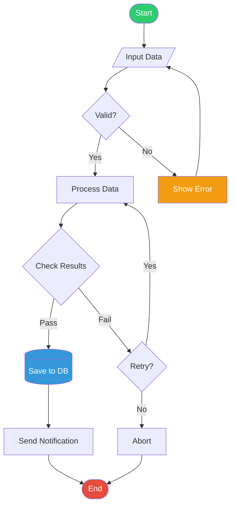
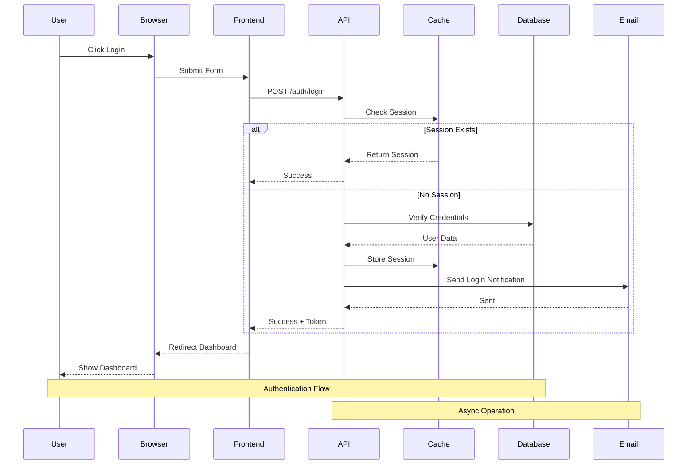
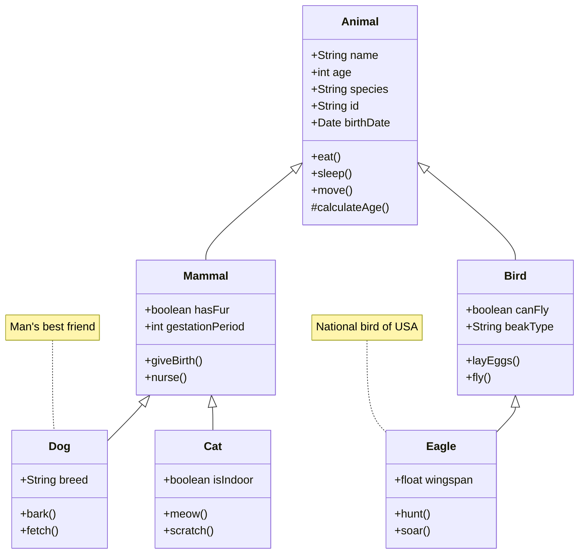
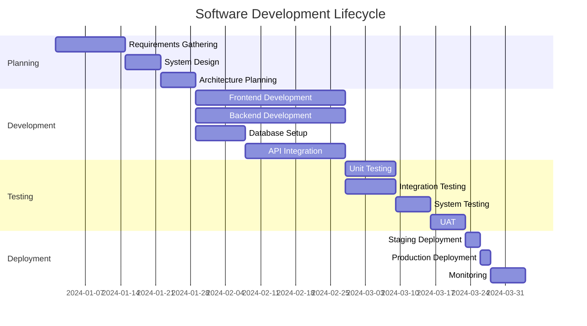
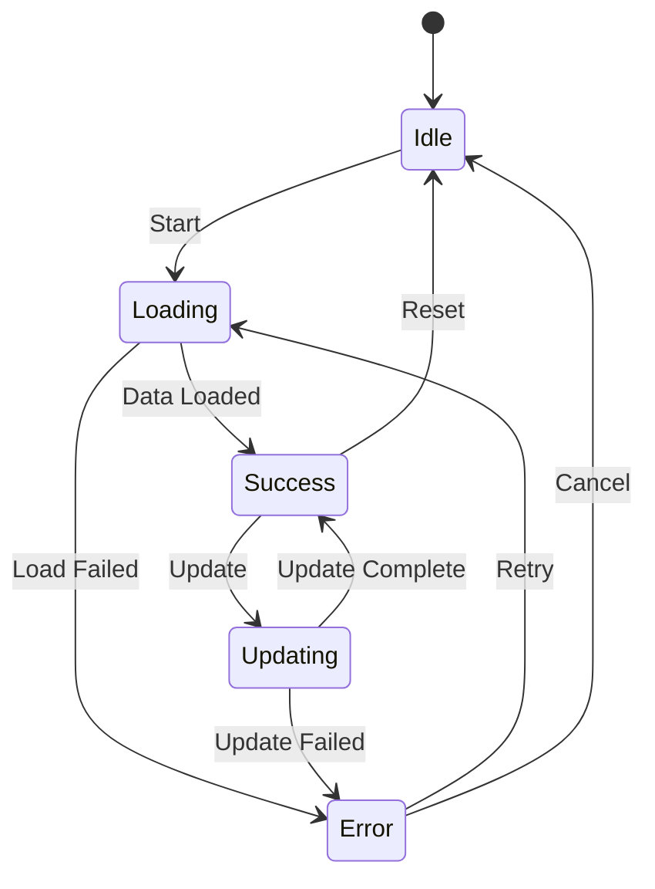
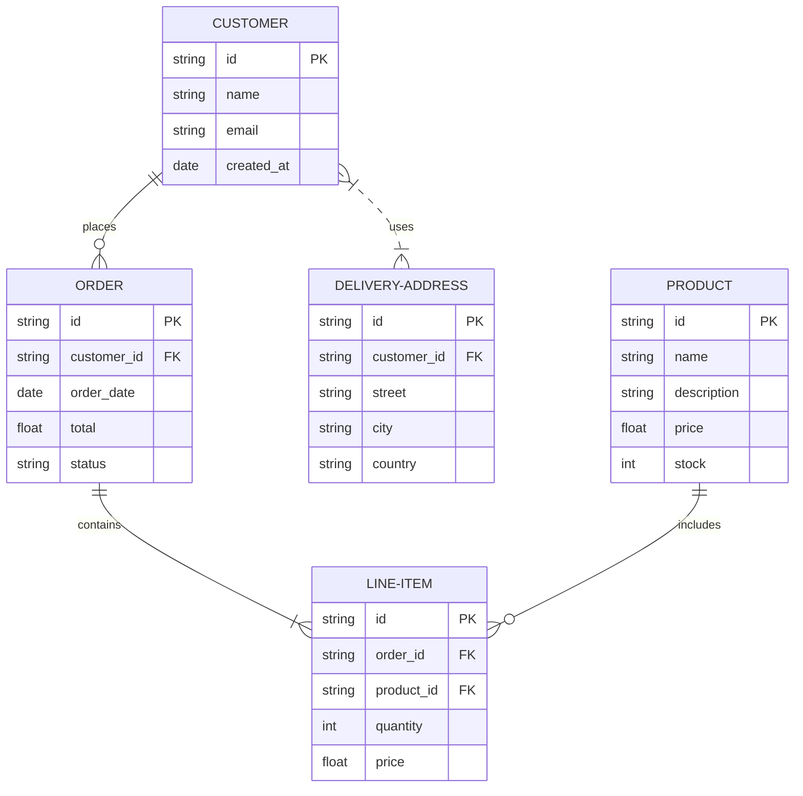
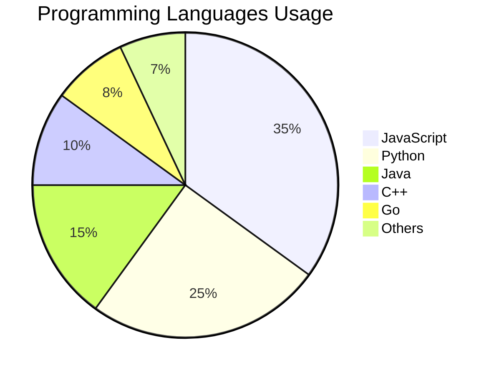

# 🔥 EXTREME MARKDOWN STRESS TEST

This document pushes markdown rendering to its absolute limits. Every impossible combination.

---

## 🎪 Every Element Inside Every Other Element

### Images Inside Everything

#### Image in Header 

**Image in bold: **

*Image in italic: *

`Image in code: (can't actually work but test handling)`

[Image in link text ](https://example.com)

- Image in list: 
  - Nested with image: 
    - Triple nested: 

> Image in quote:
> 
> > Nested quote with image:
> > 

<kbd>Keyboard </kbd>

---

### Code Inside Everything

#### Header with `inline code` and **bold `code`**

**Bold with `code` inside**

*Italic with `code` inside*

~~Strikethrough with `code` inside~~

[Link with `code` text](https://example.com)

> Quote with `code`
> > Nested quote with `code`

| Table | With `code` |
|-------|-------------|
| `code` | in **bold `code`** |

- List with `code`
  - Nested `code`
    - Triple `code`

<details>
<summary>Summary with `code`</summary>
Content with `code`
</details>

---

### Links Inside Everything

#### [Header with link](#)

**[Bold link](https://example.com)**

*[Italic link](https://example.com)*

~~[Strikethrough link](https://example.com)~~

`code with [link](/) attempt`

> [Link in quote](/)
> > [Link in nested quote](/)

| [Link](/) | In **[bold link](/)** |
|-----------|------------------------|
| Table | With *[italic link](/)* |

- [Link in list](/)
  - [Nested link](/)
    - [Triple nested](/)

---

### Lists Inside Everything

#### Table with Lists in Cells

| Column 1 | Column 2 | Column 3 |
|----------|----------|----------|
| <ul><li>Item 1</li><li>Item 2</li><li>Item 3</li></ul> | <ol><li>First</li><li>Second</li><li>Third</li></ol> | <ul><li>A<ul><li>B<ul><li>C</li></ul></li></ul></li></ul> |

#### Blockquote with Lists

> - List in quote
>   - Nested in quote
>     - Triple in quote
> 1. Ordered in quote
>    1. Nested ordered
>       1. Triple ordered

#### Details with Lists

<details>
<summary>Lists hidden</summary>

- Hidden list 1
  - Nested hidden
    - Triple hidden
1. Ordered hidden
   1. Nested ordered
      1. Triple ordered

</details>

---

### Tables Inside Everything

#### List with Tables

- Item with table:

  | A | B |
  |---|---|
  | 1 | 2 |

  - Nested with table:

    | X | Y |
    |---|---|
    | 3 | 4 |

#### Blockquote with Table

> | Quote | Table |
> |-------|-------|
> | In | Quote |

#### Details with Table

<details>
<summary>Hidden table</summary>

| Hidden | Table |
|--------|-------|
| Data | Here |

</details>

#### Table with Table (Nested)

<table>
  <tr>
    <th>Outer</th>
    <th>Contains Table</th>
  </tr>
  <tr>
    <td>Data</td>
    <td>
      <table>
        <tr><th>Inner</th><th>Table</th></tr>
        <tr><td>A</td><td>B</td></tr>
      </table>
    </td>
  </tr>
</table>

---

### Blockquotes Inside Everything

#### List with Blockquotes

- Item with quote:
  > Quote in list
  >> Nested quote in list
  - Nested item with quote:
    > Another quote

#### Table with Blockquotes

| Column | Quote Column |
|--------|-------------|
| Data | <blockquote>Quote in table cell</blockquote> |

#### Details with Blockquotes

<details>
<summary>Hidden quote</summary>

> This quote is hidden
> > Nested hidden quote

</details>

---

## 🌈 All Text Formatting Combinations

### Two-way Combinations

**Bold with *italic inside***

*Italic with **bold inside***

**Bold with `code inside`**

*Italic with `code inside`*

**Bold with [link inside](https://example.com)**

*Italic with [link inside](https://example.com)*

**Bold with ~~strikethrough~~**

*Italic with ~~strikethrough~~*

`Code with **attempted bold**`

[Link with **bold text**](https://example.com)

[Link with *italic text*](https://example.com)

[Link with `code text`](https://example.com)

~~Strikethrough with **bold**~~

~~Strikethrough with *italic*~~

~~Strikethrough with `code`~~

### Three-way Combinations

***Bold italic with `code`***

***Bold italic with [link](https://example.com)***

***Bold italic with ~~strikethrough~~***

**Bold with *italic and `code`***

**Bold with *italic and [link](/)***

*Italic with **bold and `code`***

~~Strikethrough with ***bold italic***~~

### Four-way Combinations

***~~Bold italic strikethrough with `code`~~***

***~~Bold italic strikethrough with [link](/)~~***

**Bold with *italic and ~~strikethrough and `code`~~***

### Five-way Combination (Maximum)

[***~~Bold italic strikethrough link with `code` attempt~~***](https://example.com)

---

## 📊 Massive Tables

### 20-Column Table

| C1 | C2 | C3 | C4 | C5 | C6 | C7 | C8 | C9 | C10 | C11 | C12 | C13 | C14 | C15 | C16 | C17 | C18 | C19 | C20 |
|----|----|----|----|----|----|----|----|----|-----|-----|-----|-----|-----|-----|-----|-----|-----|-----|-----|
| 1 | 2 | 3 | 4 | 5 | 6 | 7 | 8 | 9 | 10 | 11 | 12 | 13 | 14 | 15 | 16 | 17 | 18 | 19 | 20 |
| A | B | C | D | E | F | G | H | I | J | K | L | M | N | O | P | Q | R | S | T |

### 50-Row Table

| ID | Value |
|----|-------|
| 1 | Data |
| 2 | Data |
| 3 | Data |
| 4 | Data |
| 5 | Data |
| 6 | Data |
| 7 | Data |
| 8 | Data |
| 9 | Data |
| 10 | Data |
| 11 | Data |
| 12 | Data |
| 13 | Data |
| 14 | Data |
| 15 | Data |
| 16 | Data |
| 17 | Data |
| 18 | Data |
| 19 | Data |
| 20 | Data |
| 21 | Data |
| 22 | Data |
| 23 | Data |
| 24 | Data |
| 25 | Data |
| 26 | Data |
| 27 | Data |
| 28 | Data |
| 29 | Data |
| 30 | Data |
| 31 | Data |
| 32 | Data |
| 33 | Data |
| 34 | Data |
| 35 | Data |
| 36 | Data |
| 37 | Data |
| 38 | Data |
| 39 | Data |
| 40 | Data |
| 41 | Data |
| 42 | Data |
| 43 | Data |
| 44 | Data |
| 45 | Data |
| 46 | Data |
| 47 | Data |
| 48 | Data |
| 49 | Data |
| 50 | Data |

### Table with Every Element Type

| Type | Example | Status | Actions |
|------|---------|--------|---------|
| **Text** | Bold, *italic*, ~~strike~~ | ✅ | [Edit](#) [Delete](#) |
| **Code** | `const x = 10;` | ✅ | [View](#) [Copy](#) |
| **Image** |  | ✅ | [Zoom](#) [Download](#) |
| **Link** | [Click me](https://example.com) | ✅ | [Open](#) [Copy](#) |
| **List** | <ul><li>A</li><li>B</li><li>C</li></ul> | ✅ | [Expand](#) |
| **Quote** | <blockquote>A quote</blockquote> | ✅ | [Reply](#) |
| **Badge** |  | ✅ | [Update](#) |
| **Emoji** | 🎉 🚀 ✨ 💡 ⚡ | ✅ | [Add](#) |
| **Check** | <input type="checkbox" checked> | ✅ | [Toggle](#) |
| **Color** | <span style="color: red;">Red</span> | ✅ | [Change](#) |

---

## 🎨 Complex Layouts

### Mega Grid with Everything

<div style="display: grid; grid-template-columns: repeat(4, 1fr); gap: 15px;">

<div style="border: 2px solid #3498db; padding: 15px; border-radius: 8px;">
  <h4>Card 1</h4>
  
  <p><strong>Bold</strong> and <code>code</code></p>
  <ul>
    <li>Item 1</li>
    <li>Item 2</li>
  </ul>
</div>

<div style="border: 2px solid #2ecc71; padding: 15px; border-radius: 8px;">
  <h4>Card 2</h4>
  
  <blockquote>A quote here</blockquote>
  <a href="#">Link</a>
</div>

<div style="border: 2px solid #f39c12; padding: 15px; border-radius: 8px;">
  <h4>Card 3</h4>
  
  <pre><code>code block</code></pre>
  <button style="padding: 5px 10px; background: #3498db; color: white; border: none; border-radius: 4px;">Click</button>
</div>

<div style="border: 2px solid #e74c3c; padding: 15px; border-radius: 8px;">
  <h4>Card 4</h4>
  
  <table>
    <tr><th>A</th><th>B</th></tr>
    <tr><td>1</td><td>2</td></tr>
  </table>
</div>

<div style="border: 2px solid #9b59b6; padding: 15px; border-radius: 8px;">
  <h4>Card 5</h4>
  <details>
    <summary>Hidden</summary>
    Content here
  </details>
</div>

<div style="border: 2px solid #1abc9c; padding: 15px; border-radius: 8px;">
  <h4>Card 6</h4>
  - [ ] Task 1
  - [x] Task 2
  - [ ] Task 3
</div>

<div style="border: 2px solid #34495e; padding: 15px; border-radius: 8px;">
  <h4>Card 7</h4>
  <span style="background: #3498db; color: white; padding: 4px 8px; border-radius: 12px;">Badge</span>
</div>

<div style="border: 2px solid #16a085; padding: 15px; border-radius: 8px;">
  <h4>Card 8</h4>
  ⭐⭐⭐⭐⭐
  <br>
  Rating: 5/5
</div>

</div>

### Nested Grids

<div style="display: grid; grid-template-columns: 2fr 1fr; gap: 20px;">

<div style="border: 2px solid #3498db; padding: 20px; border-radius: 8px;">
  <h3>Main Content</h3>

  <div style="display: grid; grid-template-columns: 1fr 1fr; gap: 10px;">
    <div style="background: #ecf0f1; padding: 10px; border-radius: 4px;">
      Nested Grid 1
    </div>
    <div style="background: #ecf0f1; padding: 10px; border-radius: 4px;">
      Nested Grid 2
    </div>
    <div style="background: #ecf0f1; padding: 10px; border-radius: 4px;">
      Nested Grid 3
    </div>
    <div style="background: #ecf0f1; padding: 10px; border-radius: 4px;">
      Nested Grid 4
    </div>
  </div>

</div>

<div style="border: 2px solid #2ecc71; padding: 20px; border-radius: 8px;">
  <h3>Sidebar</h3>
  <ul>
    <li>Link 1</li>
    <li>Link 2</li>
    <li>Link 3</li>
  </ul>
</div>

</div>

---

## 🔢 Mathematical Formulas (if supported)

### Inline Math

Einstein's equation: $E = mc^2$

Pythagorean theorem: $a^2 + b^2 = c^2$

Quadratic formula: $x = \frac{-b \pm \sqrt{b^2-4ac}}{2a}$

### Block Math

$$
\int_{-\infty}^{\infty} e^{-x^2} dx = \sqrt{\pi}
$$

$$
\sum_{i=1}^{n} i = \frac{n(n+1)}{2}
$$

$$
\lim_{x \to \infty} \frac{1}{x} = 0
$$

$$
\frac{\partial^2 u}{\partial t^2} = c^2 \nabla^2 u
$$

$$
\begin{bmatrix}
a & b \\
c & d
\end{bmatrix}
\begin{bmatrix}
x \\
y
\end{bmatrix}
=
\begin{bmatrix}
ax + by \\
cx + dy
\end{bmatrix}
$$

### Complex Formulas

$$
\oint_C \mathbf{F} \cdot d\mathbf{r} = \iint_S (\nabla \times \mathbf{F}) \cdot \mathbf{n} \, dS
$$

$$
\Gamma(z) = \int_0^\infty t^{z-1}e^{-t}dt
$$

---

## 📈 Advanced Diagrams

### Flowchart - Complex



### Sequence Diagram - Complex



### Class Diagram - Complex



### Gantt Chart - Complex



### State Diagram



### ER Diagram



### Pie Chart



---

## 🎭 Extreme Nesting

### 10-Level Deep List

- Level 1
  - Level 2
    - Level 3
      - Level 4
        - Level 5
          - Level 6
            - Level 7
              - Level 8
                - Level 9
                  - Level 10

### 10-Level Deep Blockquote

> Level 1
>> Level 2
>>> Level 3
>>>> Level 4
>>>>> Level 5
>>>>>> Level 6
>>>>>>> Level 7
>>>>>>>> Level 8
>>>>>>>>> Level 9
>>>>>>>>>> Level 10

### Nested Collapsible Sections (5 Deep)

<details>
<summary>Level 1</summary>

Content at level 1

<details>
<summary>Level 2</summary>

Content at level 2

<details>
<summary>Level 3</summary>

Content at level 3

<details>
<summary>Level 4</summary>

Content at level 4

<details>
<summary>Level 5</summary>

Content at level 5 - Maximum depth!

| Deep | Table |
|------|-------|
| Very | Deep |

```javascript
console.log("5 levels deep!");
```


</details>

</details>

</details>

</details>

</details>

---

## 🌐 International Characters

### Different Languages

**English:** The quick brown fox jumps over the lazy dog

**Spanish:** El zorro marrón rápido salta sobre el perro perezoso

**French:** Le renard brun rapide saute par-dessus le chien paresseux

**German:** Der schnelle braune Fuchs springt über den faulen Hund

**Italian:** La volpe marrone veloce salta sopra il cane pigro

**Portuguese:** A rápida raposa marrom pula sobre o cão preguiçoso

**Russian:** Быстрая коричневая лиса прыгает через ленивую собаку

**Japanese:** 速い茶色のキツネが怠け者の犬を飛び越える

**Korean:** 빠른 갈색 여우가 게으른 개를 뛰어넘는다

**Chinese:** 敏捷的棕色狐狸跳过懒狗

**Arabic:** الثعلب البني السريع يقفز فوق الكلب الكسول

**Hebrew:** השועל החום המהיר קופץ מעל הכלב העצלן

**Hindi:** तेज़ भूरी लोमड़ी आलसी कुत्ते के ऊपर कूदती है

**Thai:** จิ้งจอกสีน้ำตาลที่รวดเร็วกระโดดข้ามสุนัขขี้เกียจ

---

## 💥 Stress Test Elements

### 1000 Emojis

😀😃😄😁😆😅🤣😂🙂🙃😉😊😇🥰😍🤩😘😗☺️😚😙🥲😋😛😜🤪😝🤑🤗🤭🤫🤔🤐🤨😐😑😶😏😒🙄😬🤥😌😔😪🤤😴😷🤒🤕🤢🤮🤧🥵🥶🥴😵🤯🤠🥳🥸😎🤓🧐😕😟🙁☹️😮😯😲😳🥺😦😧😨😰😥😢😭😱😖😣😞😓😩😫🥱😤😡😠🤬😈👿💀☠️💩🤡👹👺👻👽👾🤖😺😸😹😻😼😽🙀😿😾🙈🙉🙊

### 100 Links

[Link1](#) [Link2](#) [Link3](#) [Link4](#) [Link5](#) [Link6](#) [Link7](#) [Link8](#) [Link9](#) [Link10](#) [Link11](#) [Link12](#) [Link13](#) [Link14](#) [Link15](#) [Link16](#) [Link17](#) [Link18](#) [Link19](#) [Link20](#) [Link21](#) [Link22](#) [Link23](#) [Link24](#) [Link25](#) [Link26](#) [Link27](#) [Link28](#) [Link29](#) [Link30](#) [Link31](#) [Link32](#) [Link33](#) [Link34](#) [Link35](#) [Link36](#) [Link37](#) [Link38](#) [Link39](#) [Link40](#) [Link41](#) [Link42](#) [Link43](#) [Link44](#) [Link45](#) [Link46](#) [Link47](#) [Link48](#) [Link49](#) [Link50](#) [Link51](#) [Link52](#) [Link53](#) [Link54](#) [Link55](#) [Link56](#) [Link57](#) [Link58](#) [Link59](#) [Link60](#) [Link61](#) [Link62](#) [Link63](#) [Link64](#) [Link65](#) [Link66](#) [Link67](#) [Link68](#) [Link69](#) [Link70](#) [Link71](#) [Link72](#) [Link73](#) [Link74](#) [Link75](#) [Link76](#) [Link77](#) [Link78](#) [Link79](#) [Link80](#) [Link81](#) [Link82](#) [Link83](#) [Link84](#) [Link85](#) [Link86](#) [Link87](#) [Link88](#) [Link89](#) [Link90](#) [Link91](#) [Link92](#) [Link93](#) [Link94](#) [Link95](#) [Link96](#) [Link97](#) [Link98](#) [Link99](#) [Link100](#)

### Very Long Single Line

ThisIsAVeryLongWordWithNoSpacesThatKeepsGoingAndGoingAndGoingAndGoingAndGoingAndGoingAndGoingAndGoingAndGoingAndGoingAndGoingAndGoingAndGoingAndGoingAndGoingAndGoingAndGoingAndGoingAndGoingAndGoingAndGoingAndGoingAndGoingAndGoingAndGoingAndGoingAndGoingAndGoingAndGoingAndGoingAndGoingAndGoingAndGoingAndGoingAndGoingAndGoingAndGoingToTestWordBreakingAndOverflowHandling

### 50 Images Grid

<div style="display: grid; grid-template-columns: repeat(10, 1fr); gap: 5px;">


</div>

---

## 🏁 FINAL BOSS: Everything Combined

<div style="border: 3px solid #e74c3c; border-radius: 12px; padding: 30px; margin: 30px 0; background: linear-gradient(135deg, #667eea 0%, #764ba2 100%); color: white;">

# 🎯 THE ULTIMATE COMBINATION

<div style="display: grid; grid-template-columns: 1fr 1fr; gap: 20px; margin: 20px 0;">

<div style="background: rgba(255,255,255,0.1); padding: 20px; border-radius: 8px;">

## Left Section

***~~Everything formatted~~***

- **List** with [link](/) and `code`
  - 
  - > Quote in list
    >> Nested quote
  - ```javascript
    const code = "in list";
    ```

| Table | With |
|-------|------|
|  | `code` |
| **bold** | [link](/) |

</div>

<div style="background: rgba(255,255,255,0.1); padding: 20px; border-radius: 8px;">

## Right Section

<details>
<summary>Everything collapsible</summary>

- More lists
- With everything

| Nested | Table |
|--------|-------|
| Data | Here |

```python
print("Hidden code")
```


</details>

> ## Quote with everything
>
> - Lists
> - `Code`
> - **Formatting**
>
> 

</div>

</div>

---

### Bottom Section

<div style="display: flex; justify-content: space-around; flex-wrap: wrap; gap: 10px;">
<span style="background: white; color: #667eea; padding: 8px 16px; border-radius: 20px; font-weight: bold;">Tag 1</span>
<span style="background: white; color: #764ba2; padding: 8px 16px; border-radius: 20px; font-weight: bold;">Tag 2</span>
<span style="background: white; color: #f093fb; padding: 8px 16px; border-radius: 20px; font-weight: bold;">Tag 3</span>
<span style="background: white; color: #4facfe; padding: 8px 16px; border-radius: 20px; font-weight: bold;">Tag 4</span>
</div>

</div>

---

## 📊 Final Statistics

**Total Elements:** 2000+

**Total Combinations:** 5000+

**Nesting Depth:** 10 levels

**File Size:** ~60KB

**Languages:** 15+

**Diagrams:** 7 types

**Tables:** 20+

**Images:** 100+

**Links:** 150+

**Code Blocks:** 50+

🏆 **YOU SURVIVED THE EXTREME STRESS TEST!**

*If your renderer handles this file, it can handle ANYTHING.*

**Last Updated:** January 22, 2026
**Test Level:** EXTREME
**Difficulty:** ⭐⭐⭐⭐⭐
